<!-- Please do not change this logo with link -->

# LED Blinky Using AVR DA Microcontroller and FreeRTOS

The blinky project is a basic example that shows how to get a FreeRTOS project using the MCC Melody library. The MCC Melody generated project offers a seamless integration of the FreeRTOS kernel files and port files, by providing a basic project structure that can be used as starting point for an RTOS application.

As a minimum, the [<strong>blinky project</strong>](avr128da48_cnano_freertos_blinky_melody.X) will demonstrate how to use a [<strong>FreeRTOS queue</strong>](https://www.freertos.org/Embedded-RTOS-Queues.html) to pass a value between two tasks and toggling an LED each time the value is received.

The project is contained in a single source file (<strong>freertos_interface.c</strong>) as following:

1. The main application loop creates one queue and two tasks, then starts the RTOS scheduler.
2. The Queue Send Task is implemented by <strong>prvQueueSendTask()</strong>. It sends a fixed value (100) to the queue every 200 milliseconds.
3. The Queue Receive Task is implemented by <strong>prvQueueReceiveTask()</strong>. It blocks on queue reads, unblocking and toggling an LED each time the message from the queue send task is received. The queue send task sends to the queue every 200 milliseconds, so the queue receive task leaves the Blocked state and toggles the LED every 200 milliseconds.

## Related Documentation

More details and code examples on the AVR128DA48 can be found at the following links:

- [FreeRTOS™ pages](https://www.freertos.org/index.html)
- [FreeRTOS Demo for the Microchip AVR Dx Port](https://www.freertos.org/microchip-avr-dx-demo.html)
- [AVR128DA48 Product Page](https://www.microchip.com/wwwproducts/en/AVR128DA48?utm_source=GitHub&utm_medium=TextLink&utm_campaign=MCU8_AVR-DA&utm_content=avr128da48-freertos-blinky-mplab-mcc-github&utm_bu=MCU08)
- [AVR128DA48 Code Examples on GitHub](https://github.com/microchip-pic-avr-examples?q=AVR128DA48)

## Software Used

- MPLAB X IDE 6.20 or newer [(microchip.com/mplab/mplab-x-ide)](https://www.microchip.com/en-us/tools-resources/develop/mplab-x-ide?utm_source=GitHub&utm_medium=TextLink&utm_campaign=MCU8_AVR-DA&utm_content=avr128da48-freertos-blinky-mplab-mcc-github&utm_bu=MCU08)
- MPLAB XC8 2.46 or a newer compiler [(microchip.com/mplab/compilers)](https://www.microchip.com/en-us/tools-resources/develop/mplab-xc-compilers?utm_source=GitHub&utm_medium=TextLink&utm_campaign=MCU8_AVR-DA&utm_content=avr128da48-freertos-blinky-mplab-mcc-github&utm_bu=MCU08)
- MPLAB Code Configurator (MCC) 5.7.1 or newer [(microchip.com/mplab/mplab-code-configurator)](https://www.microchip.com/en-us/tools-resources/configure/mplab-code-configurator?utm_source=GitHub&utm_medium=TextLink&utm_campaign=MCU8_AVR-DA&utm_content=avr128da48-freertos-blinky-mplab-mcc-github&utm_bu=MCU08)
- AVR-Dx 2.6.303 or newer Device Pack [(https://packs.download.microchip.com)](https://packs.download.microchip.com/#collapse-Microchip-AVR-Dx-DFP-pdsc)

## MCC Configuration

- AVR Devices package 4.11.0 or newer
- FreeRTOS Library v2.0.1

## Hardware Used

- AVR128DA48 Curiosity Nano Evaluation Kit

## Setup

[The AVR128DA48 Curiosity Nano Evaluation Kit](https://www.microchip.com/en-us/development-tool/dm164151?utm_source=GitHub&utm_medium=TextLink&utm_campaign=MCU8_AVR-DA&utm_content=avr128da48-freertos-blinky-mplab-mcc-github&utm_bu=MCU08) is used as test platform:

 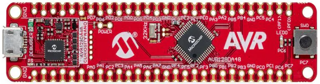

The following configurations must be made for this project:

1. Add FreeRTOS library to the project

 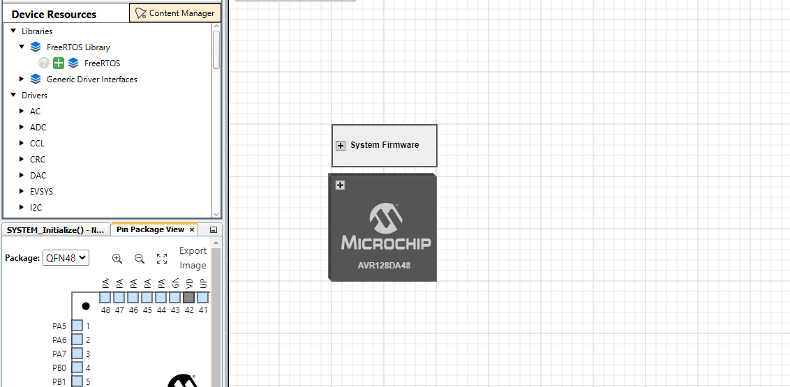

2. Configure FreeRTOS application:  
    2.1 Select timer instance used as TIck Timer (TCB0 in this example)  
    2.2 Configure the desired Tick Rate   
    2.3 Update the FreeRTOS configuration using the UI  
    2.4 Enable GPIO pins used by the FreeRTOS application (GPIO0)  
    2.5 Select the corresponding pin used as GPIO0 by the FreeRTOS application (PC6, Curiosity NANO on-board LED0)  
 
 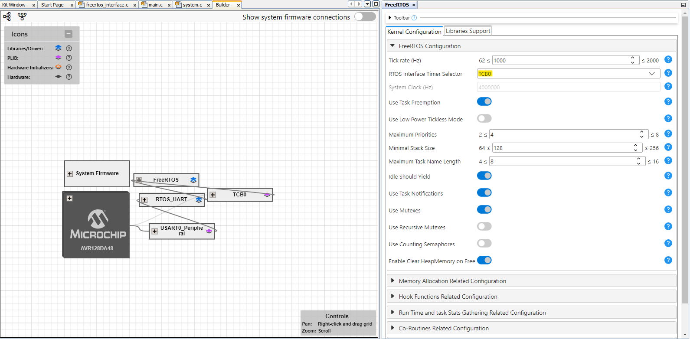

 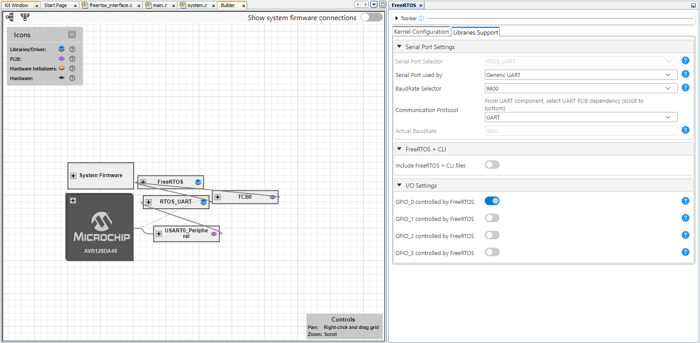

4. Select the on-board LED (PC6) as GPIO0 pin that is used by the FreeRTOS library

 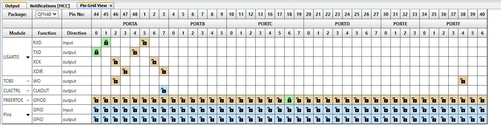

5. Generate the code using MCC Melody

6. Add the demo application code in the freertos_interface.c file

7. For information about the programming the device, see the Operation section in this document

| Pin |     Configuration     |
| :-: | :-------------------: |
| PC6 | Digital Output (LED0) |

In order to configure the toggling period for the on-board LED the macro below can be modified. In the default case, this period is configured to 200 ms:

 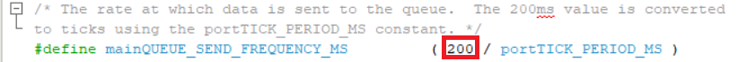

## Operation

To program the Curiosity Nano board with this MPLAB X project, follow the steps provided in the [How to Program the Curiosity Nano Board](#how-to-program-the-curiosity-nano-board) chapter.  

## Demo

The application toggles the on-board LED every 200 ms:

 
 
 The result can be seen also by watching the signal with the logic analyzer:
 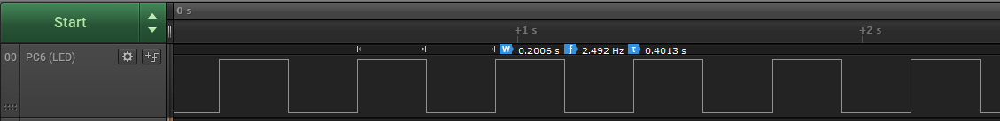

 

## Summary

This example shows how to use the FreeRTOS library to create a basic demo application that toggles the on-board LED (PC6) with a configurable period.
 

## How to Program the Curiosity Nano Board

This chapter demonstrates how to use the MPLAB X IDE to program a AVR® device with an Example_Project.X. This is applicable to other projects.

1.  Connect the board to the PC.

2.  Open the `Example_Project.X` project in MPLAB X IDE.

3.  Set the `Example_Project.X` project as main project.
     Right click the project in the **Projects** tab and click **Set as Main Project**.
     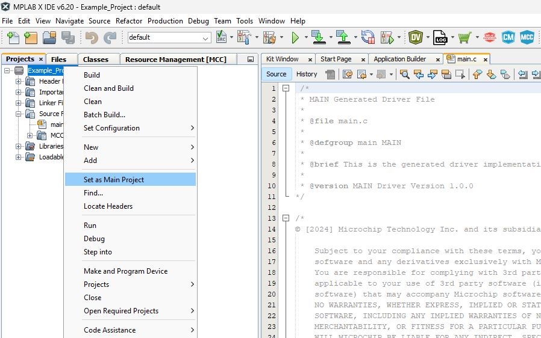

4.  Clean and build the `Example_Project.X` project.
     Right click the `Example_Project.X` project and select **Clean and Build**.
     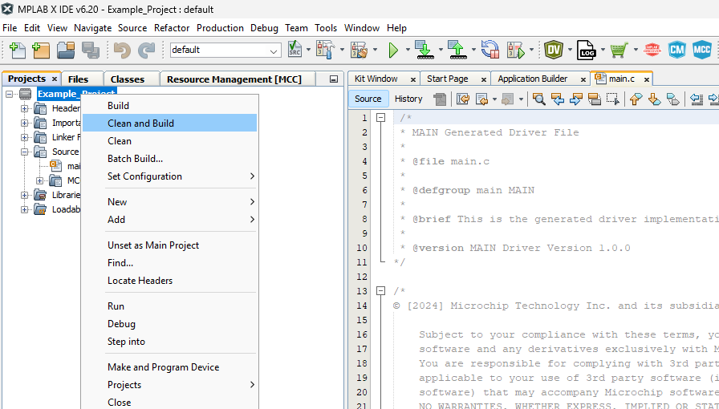

5.  Select **PICxxxxx Curiosity Nano** in the Connected Hardware Tool section of the project settings:
     Right click the project and click **Properties**.
     Click the arrow under the Connected Hardware Tool.
     Select **AVRxxxxx Curiosity Nano** (click the **SN**), click **Apply** and then click **OK**:
     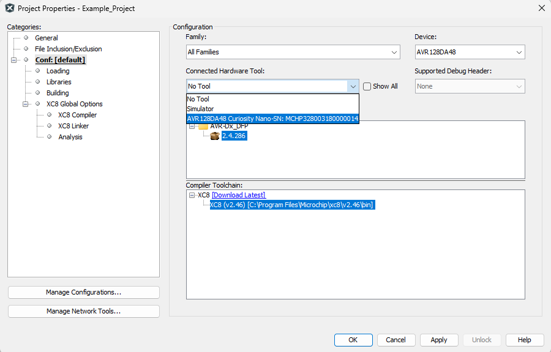

6.  Program the project to the board.
     Right click the project and click **Make and Program Device**.
     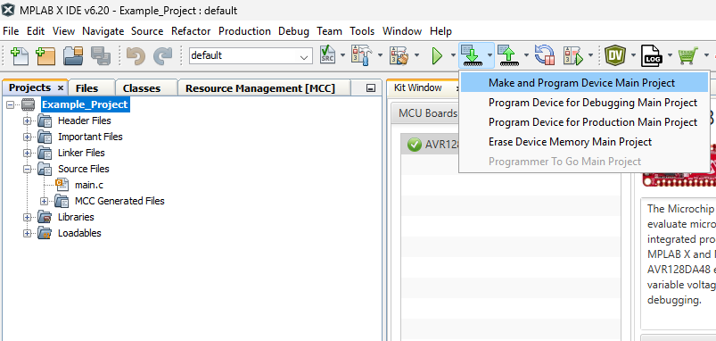

 

---

## Menu

- [Back to Top](#led-blinky-using-avr-da-microcontroller-and-freertos)
- [Back to Related Documentation](#related-documentation)
- [Back to Software Used](#software-used)
- [Back to Operation](#mcc-configuration)
- [Back to Hardware Used](#hardware-used)
- [Back to Setup](#setup)
- [Back to Demo](#demo)
- [Back to Summary](#summary)
- [Back to How to Program the Curiosity Nano Board](#how-to-program-the-curiosity-nano-board)